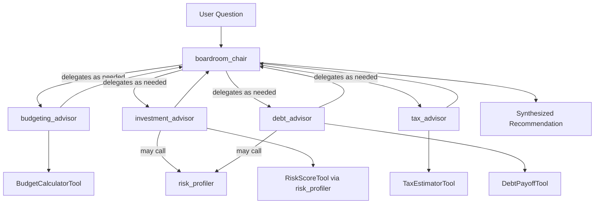

# Architecture: Personal Finance Boardroom

## 1. What This Project Does

Personal Finance Boardroom lets a user describe a financial question or situation in plain language and receive a single, synthesized recommendation drawn from a "board" of specialist AI advisors — Budgeting, Investment, Tax, and Debt — coordinated by a Boardroom Chair agent.

Rather than one generic model giving one generic answer, the system models how real financial decisions get made: by consulting multiple domain experts who sometimes disagree, and by making those disagreements and trade-offs explicit to the user instead of quietly averaging them away.

**Example:** A user enters *"I have $5,000 in credit card debt at 22% APR and $3,000 in savings. Should I invest or pay off debt first?"* The Chair recognizes this question touches both debt strategy and investment strategy, and routes it to both the `debt_advisor` and `investment_advisor`. Both specialists independently consult the shared `risk_profiler` sub-agent to ground their reasoning in the user's actual risk tolerance. The `debt_advisor` computes payoff math via `DebtPayoffTool`; the `investment_advisor` reasons about expected returns relative to the 22% guaranteed "return" of paying off debt. The Chair then synthesizes both perspectives into one answer, explicitly noting where they agree (pay off the high-APR debt first) and where nuance remains (how much of the $3,000 to hold back as an emergency buffer). This is the kind of layered, cross-domain judgment a single-prompt chatbot tends to flatten or hallucinate — here it's grounded in real delegation and real computation at every step.

## 2. How It Achieves That: Agentic System Design

This project is built entirely on **Neuro SAN**, using its declarative, data-driven multi-agent orchestration framework. Every architectural decision below exists specifically to demonstrate a distinct Neuro SAN capability rather than to reimplement generic AI-app patterns.

### 2.1 Agent Network

Defined declaratively in `backend/registries/boardroom.hocon` — the entire board is data, not code:



- **`boardroom_chair`** — the front-man agent. It receives the user's question and decides, using its own judgment rather than hardcoded if/else routing, which specialists are relevant to the specific question asked. It also performs the final synthesis step, explicitly surfacing where specialists agreed or disagreed.
- **`budgeting_advisor`, `investment_advisor`, `tax_advisor`, `debt_advisor`** — specialist agents, each with domain-specific instructions and their own dedicated CodedTool.
- **`risk_profiler`** — a **shared sub-agent**. Both `investment_advisor` and `debt_advisor` can independently choose to call it. This is the clearest demonstration in the project of Neuro SAN's **AAOSA** (Adaptive Agent Oriented Software Architecture) protocol: decentralized delegation, where agents decide amongst themselves who to involve on a per-question basis, rather than following a fixed, predetermined pipeline.

### 2.2 Sly-Data — Privacy-Preserving Data Flow

All sensitive financial figures (income, expenses, debt balances, APRs, retirement savings) are passed through Neuro SAN's **`sly_data`** mechanism, which keeps this information out of the LLM's raw prompt entirely.

CodedTools read `sly_data` directly in Python and return only derived, safe values back to the agents — for example, `"debt-to-income ratio: 38%, high"` instead of the underlying raw account balances. This means the actual numbers are never seen or logged by the LLM provider, which directly addresses a genuine privacy concern in any application handling personal financial data.

### 2.3 CodedTools — Deterministic Computation

Located in `backend/coded_tools/boardroom/`:

| Tool | Purpose |
|---|---|
| `BudgetCalculatorTool` | Computes savings rate and expense breakdown |
| `DebtPayoffTool` | Compares avalanche vs. snowball payoff strategies |
| `TaxEstimatorTool` | Estimates tax owed using static 2026 bracket data |
| `RiskScoreTool` | Computes a risk-tolerance category from survey answers |

These are pure, deterministic Python — no LLM calls involved. This demonstrates Neuro SAN's intended separation of concerns: **agents handle natural-language reasoning and delegation; tools handle deterministic computation.** No financial math is ever left to the LLM to "figure out" or hallucinate.

### 2.4 LLM Configuration

Configured via Neuro SAN's provider-agnostic `llm_config`, currently running on Google Gemini (`gemini-2.5-flash`). Per-agent LLM overrides are supported natively by the framework, meaning different agents could use different models sized to the reasoning complexity they individually need — a capability the architecture supports even though this build uses a single model for simplicity.

### 2.5 Frontend

A Streamlit app (`frontend/streamlit_app.py`) provides:

- A structured intake form that builds the `sly_data` payload
- A chat interface to the agent network
- A **reasoning-trace viewer**, exposing which agents and tools were invoked and in what order — making the AAOSA delegation visible and legible to the end user, not just to a developer inspecting logs

## 3. Why This Is a Genuine Multi-Agent System, Not a Single LLM Call

No single prompt could reliably hold "budgeting logic + debt payoff math + tax bracket data + risk profiling + cross-domain trade-off synthesis" without either hallucinating numbers or losing coherence somewhere in the reasoning chain. By splitting these into specialist agents with dedicated tools:

- Each piece of reasoning is grounded in real computation, not model guesswork
- Delegation is adaptive per-question (via AAOSA), not a fixed pipeline that runs every specialist regardless of relevance
- The Chair's synthesis step explicitly surfaces disagreement between specialists — a step a single-agent system would have no structural reason to perform, and would likely paper over into one falsely confident answer

## 4. Project Structure

```
personalfinance-boardroom/
├── backend/
│   ├── registries/
│   │   ├── manifest.hocon           # Active agent registry
│   │   └── boardroom.hocon          # Multi-agent network definition
│   └── coded_tools/
│       └── boardroom/
│           ├── budget_calculator.py  # CodedTool: budget breakdown & savings rate
│           ├── debt_payoff.py        # CodedTool: avalanche vs snowball payoff
│           ├── tax_estimator.py      # CodedTool: 2026 tax bracket estimation
│           ├── risk_score.py         # CodedTool: risk tolerance scoring
│           └── data/
│               └── tax_brackets_2026.json
├── frontend/
│   └── streamlit_app.py             # Streamlit chat UI + financial intake form
├── requirements.txt                 # Python dependencies
├── architecture.md                  # This file
├── summary.md                       # Project summary
└── README.md                        # Setup and usage instructions
```